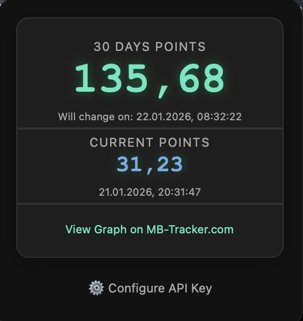

# Winamax Supercharged Points Extractor
_by MB-Tracker_

---

A browser extension that extracts the Supercharged points from Winamax and sends them to MB-Tracker for tracking and analysis.


## Features
- Automatically finds your current Supercharged points
- Sends data to MB-Tracker via a secure API
- User-friendly popup for configuration


> Example of the extension popup displaying current and 30-day Supercharged points.
  
## Installation

### Chrome (based)
1. Clone or download this repository.
2. Open your browser's extensions page (e.g., `chrome://extensions/`).
3. Enable "Developer mode".
4. Click "Load unpacked" and select the project directory.
5. Configure your API key in the extension popup.

### Firefox
1. Open `about:debugging#/runtime/this-firefox`.
2. Click **Load Temporary Add-on...**.
3. Select the `firefox.xpi` file from the project directory.
_(You can also select the `manifest.json` file, you will need to reinstall the extension every time you restart Firefox)_
4. Configure your API key in the extension popup.

### Safari (macOS)
1. Ensure you have Xcode installed.
2. Open Terminal and run:
   ```bash
   xcrun safari-web-extension-converter /path/to/project --project-location /path/to/new/Directory
   ```
3. Open the generated Xcode project.
4. Run the project. You may need to enable "Unsigned Extensions" in Safari's Developer Settings if you don't have a Developer ID.
5. And most likely also enable the Extension iteslf in the Safari's Extensions page.
6. Configure your API key in the extension popup.
   
## Requirements
- An account on [MB-Tracker.com](https://mb-tracker.com/) to obtain an API key.
- An API key: https://mb-tracker.com/accounts/api-keys/
